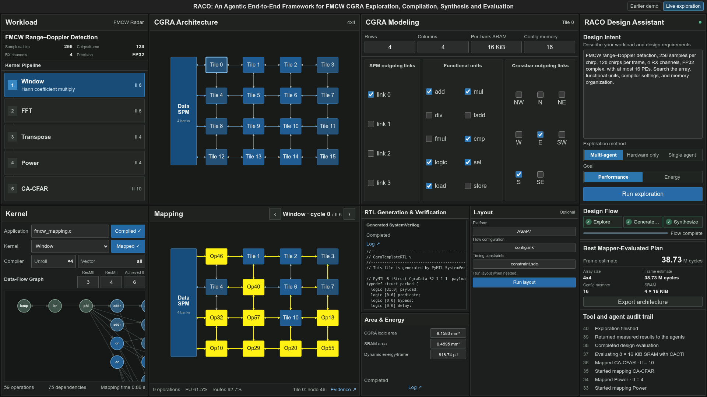

<h1 align="center"> RACO: Agentic CGRA Hardware/Software Co-Design for FMCW Radar with CHIA</h1>

<p align="center"><a href="paper/paper.tex">Paper source</a> · <a href="#-quick-start">Quick start</a> · <a href="chia-raco/results/README.md">Results and logs</a> · <a href="#-run-a-new-exploration">Live exploration</a></p>

---

## 📸 Demo

[](assets/live-flow-synthesis-passed.png)

*Recorded run showing mapping, RTL verification, and synthesis. Layout is optional.*

## 🚀 Quick start

On Linux x86-64, install Git, `make`, a C compiler, and Python 3.10+. Then check the saved results without a model or Docker:

```bash
git clone https://github.com/zsjiang99/RACO.git
cd RACO
make -C chia-raco artifact-check
```

## 🖥️ Open the browser demo

This requires Node.js 20.19+ or 22.12+ and npm in addition to Python 3.10+. From the repository root:

```bash
python3.10 -m venv .venv
.venv/bin/python -m pip install -r gui/requirements.txt
(cd gui/frontend && npm ci && npm run build)
bash gui/start.sh
```

Open `http://127.0.0.1:8765/` to inspect the saved CGRA design in the workbench. The paper's 38.73M-cycle run is in the [saved results](chia-raco/results/matched_budget_10/). To change the port, set `A3_GUI_PORT` before starting the server. The server has no authentication and binds to loopback; do not expose it publicly.

## 🤖 Run a new exploration

First complete the browser-demo setup above. Live exploration additionally needs Docker Engine, an OpenAI-compatible model endpoint, and at least 25 GB of free Docker storage. Docker supplies LLVM and EDA tools; no local GPU is needed when the model endpoint is remote.

### 🧰 Install the mapper and RTL tools

```bash
mkdir -p external
git clone https://github.com/tancheng/CGRA-Mapper.git external/CGRA-Mapper
git -C external/CGRA-Mapper checkout 5f8393acb6b3a17146806ec93a57f76f875be232
docker build -t cgramapper:v1 -f chia-raco/docker/mapper.Dockerfile external/CGRA-Mapper
docker pull cgra/neura-flow:20260114
```

### 📦 Install CHIA, RACO, and the agent classes

```bash
git clone https://github.com/ucb-bar/chia.git external/chia
git -C external/chia checkout 16c35e92aaaf9511c6453bf94cd5cf589698f4e3
.venv/bin/python -m pip install ./external/chia
.venv/bin/python -m pip install -e 'chia-raco[test]'
git clone https://github.com/coredac/MACO.git external/upstream-agents
git -C external/upstream-agents checkout 31c02ce013838d89ef2a6d211acfdf639ecb178d
```

The agent checkout supplies upstream classes; the project and interface are named RACO. To check the installation:

```bash
RACO_AGENT_DIR="$PWD/external/upstream-agents/agent" make -C chia-raco test PYTHON=../.venv/bin/python
make -C chia-raco mapper-smoke PYTHON=../.venv/bin/python
```

### ▶️ Start the live workflow

Start a model service that permits at least 4096 completion tokens, then set its endpoint and model ID. Set `RACO_LLM_API_KEY` too if your endpoint requires one.

```bash
export RACO_AGENT_DIR="$PWD/external/upstream-agents/agent"
export RACO_LLM_BASE_URL=http://127.0.0.1:18161/v1
export RACO_LLM_MODEL=your-served-model-id
bash gui/start.sh
```

Open `http://127.0.0.1:8765/`, choose **Multi-agent**, **Hardware only**, or **Single agent**, then click **Run exploration**. Run one exploration at a time. The workflow maps the FMCW kernels, generates and verifies RTL, and synthesizes the selected design. Layout is a separate, optional action.

## 📄 License and credit

Zesong Jiang, Cheng Tan, and Jeff Zhang · Arizona State University. New integration code is BSD-3-Clause licensed. The agent modules are fetched from a pinned [upstream checkout](https://github.com/coredac/MACO); other dependencies retain their own terms. See the [third-party notices](gui/THIRD_PARTY.md).
