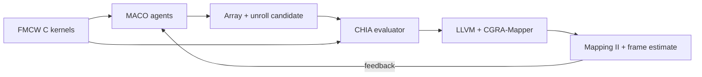

# CHIA-MACO-FMCW

Agent-guided compiler–architecture exploration for an FMCW radar pipeline on a CGRA.

[Paper (PDF)](paper/paper.pdf) · [Results and provenance](chia-maco/results/README.md) · [Reproduce](docs/REPRODUCE.md) · [Browser demo](docs/REPRODUCE.md#browser-demo)

## What this release does

Four MACO agent roles propose array sizes and compiler unroll factors. A CHIA
evaluator compiles five FMCW kernel views with LLVM 12, maps them with
CGRA-Mapper, and returns mapping results for the next agent round. The workload
represents 256 samples/chirp, 128 chirps/frame, and four receive channels;
the FFT kernel is used for both range and Doppler processing.



The reported search varies **array size and per-kernel unroll factors**.
Functional-unit placement, memory banking, RTL, and layout are separate
experimental extensions, not part of the paper's search result.

## Main result

| Search | Unique mapper runs | Best estimated cycles/frame | Archived wall time |
| --- | ---: | ---: | ---: |
| Exhaustive reference | 36 | 39,154,344 | 38.71 s |
| MACO agents (12 model calls) | 18 | 39,154,344 | 210.43 s |

The agent reached the reference's best estimate with fewer mappings, **but took
longer overall**. Cycles/frame is calculated from measured mapper initiation
intervals; it is not measured throughput or physical-design energy. The
[results index](chia-maco/results/README.md) links each claim to its source.

## Start here

To check the native radar workload and archived paper numbers without Docker
or an LLM:

```bash
git clone https://github.com/zsjiang99/CHIA-MACO-FMCW.git
cd CHIA-MACO-FMCW
make -C chia-maco artifact-check
```

For a fresh CGRA-Mapper search, an agent run, or the local GUI, follow the
[reproduction guide](docs/REPRODUCE.md). A new LLM run may propose different
candidates; the reported run and raw evidence remain in the repository.

## Repository map

| Path | Contents |
| --- | --- |
| [`chia-maco/src/chia_maco/`](chia-maco/src/chia_maco/) | CHIA node, candidate/evaluation contracts, frame model, and agent loop |
| [`chia-maco/workload/`](chia-maco/workload/) | Native FMCW C reference and mapping views |
| [`chia-maco/results/`](chia-maco/results/) | Reported runs, raw mapper logs, model trace, and validation records |
| [`gui/`](gui/) | Local browser demo; optional RTL/layout controls are distinct from paper results |
| [`paper/`](paper/) | Four-page IEEE-style PDF and LaTeX source |

The native workload smoke test is not a candidate-hardware correctness test.
Independent NumPy/native comparison has exact CA-CFAR mask agreement in 2 of 6
scenes; all failures are retained. See the [implementation status](chia-maco/IMPLEMENTATION_STATUS.md)
for the RTL and layout boundary. The current candidate schema and evaluator
name five FMCW kernels, so this release is a **reusable CHIA loop example for
FMCW**, not a claim of arbitrary-workload support.

New integration code is BSD-3-Clause licensed. Original MACO agent sources
are fetched from a pinned [upstream MACO](https://github.com/coredac/MACO)
checkout rather than copied into this release; other dependencies retain their
own terms. See [third-party notices](gui/THIRD_PARTY.md).
