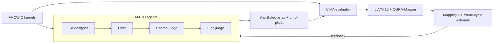

# MACO × CHIA: FMCW CGRA Co-Design

**A multi-agent design loop that uses compiler feedback to explore a CGRA for FMCW radar.**

[Paper (PDF)](paper/paper.pdf) · [Reproduce](docs/REPRODUCE.md) · [Results and logs](chia-maco/results/README.md) · [Browser demo](docs/REPRODUCE.md#browser-demo)

## 🧭 Overview

MACO proposes CGRA designs; CHIA evaluates them with compiler tools and returns evidence for the next round. This release applies that loop to an FMCW range–Doppler pipeline: **256 samples/chirp × 128 chirps/frame × 4 RX channels**, with FP32 complex data. Five C kernel views cover windowing, FFT (used for both range and Doppler), transpose, power, and CA-CFAR.



| Agent | Role |
| --- | --- |
| **Co-designer** | Proposes array-size and per-kernel unroll choices. |
| **Fixer** | Repairs proposals and enforces the legal search space. |
| **Coarse judge** | Shortlists valid candidates. |
| **Fine judge** | Predicts the best shortlist member; shortlisted plans are evaluated. |

The [agent loop](chia-maco/src/chia_maco/agent_search.py) calls the original MACO agent roles; the [CHIA node](chia-maco/src/chia_maco/nodes.py) evaluates candidates through [CGRA-Mapper](chia-maco/src/chia_maco/mapper.py). The [frame model](chia-maco/src/chia_maco/report.py) converts mapping results into feedback. Agent sources are fetched from a pinned [upstream MACO](https://github.com/coredac/MACO) checkout rather than redistributed here.

## 🚀 Quick start

Check the native FMCW workload and **archived** paper results without Docker or an LLM:

```bash
git clone https://github.com/zsjiang99/CHIA-MACO-FMCW.git
cd CHIA-MACO-FMCW
make -C chia-maco artifact-check
```

For a fresh mapper search, a new agent run, or the browser demo, follow the [reproduction guide](docs/REPRODUCE.md). A new LLM run may propose different candidates; the reported run and raw evidence remain in the repository.

## 📊 Result

| Search | Unique mapper runs | Best estimated cycles/frame | Archived wall time |
| --- | ---: | ---: | ---: |
| Exhaustive reference | 36 | 39,154,344 | 38.71 s |
| MACO agents (12 model calls) | 18 | 39,154,344 | 210.43 s |

The agents reached the reference's best frame-cycle estimate with **half as many mapper runs**, but took **longer overall**. Frame cycles are calculated from mapper initiation intervals, not measured throughput. The [results index](chia-maco/results/README.md) links the underlying candidates, mapper logs, model trace, and validation records.

## 📂 Repository

| Path | Purpose |
| --- | --- |
| [`chia-maco/src/chia_maco/`](chia-maco/src/chia_maco/) | Agent loop, CHIA evaluation node, mapper adapter, and frame model |
| [`chia-maco/workload/`](chia-maco/workload/) | FMCW C reference and compiler-mapping views |
| [`chia-maco/results/`](chia-maco/results/) | Archived searches, raw tool evidence, and validation |
| [`gui/`](gui/) | Local browser demo and optional hardware-flow controls |
| [`paper/`](paper/) | Four-page IEEE-style paper and LaTeX source |

## 🔎 Scope and attribution

The paper's search varies **array size and five unroll factors**. FU placement, memory banking, RTL, and layout are experimental GUI extensions, not part of the reported search. Mapper success does not certify candidate-hardware correctness; the native smoke test is separate, and exact NumPy/native CA-CFAR mask agreement holds in only **2 of 6** scenes. No measured FPS, full-CGRA area, or total energy claim follows from these results. See the [implementation status](chia-maco/IMPLEMENTATION_STATUS.md).

New integration code is BSD-3-Clause licensed. Upstream MACO and other dependencies retain their own terms; see the [third-party notices](gui/THIRD_PARTY.md). This release is an FMCW-specific CHIA loop example, not a claim of arbitrary-workload support.
